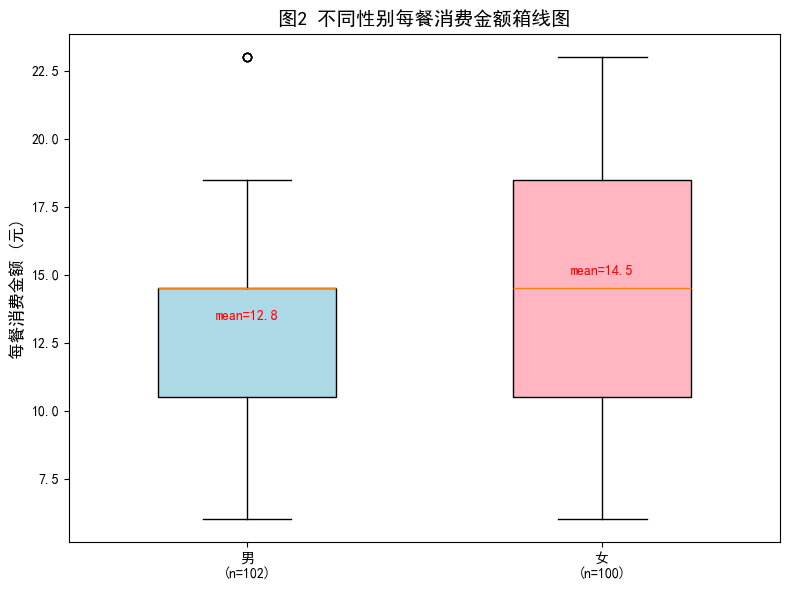
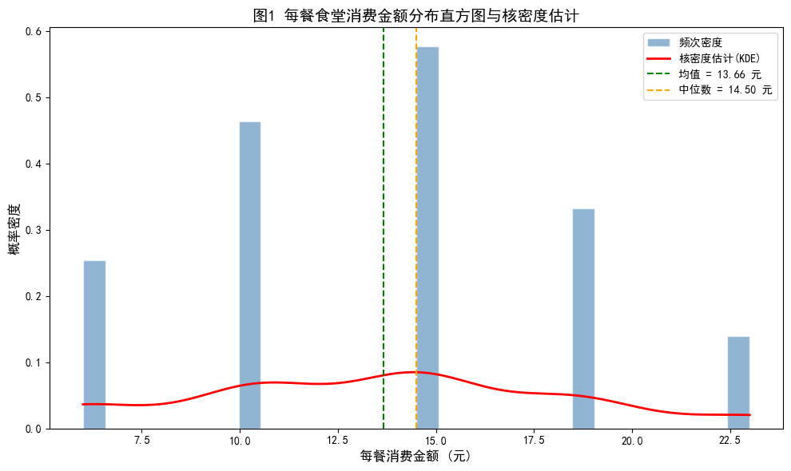
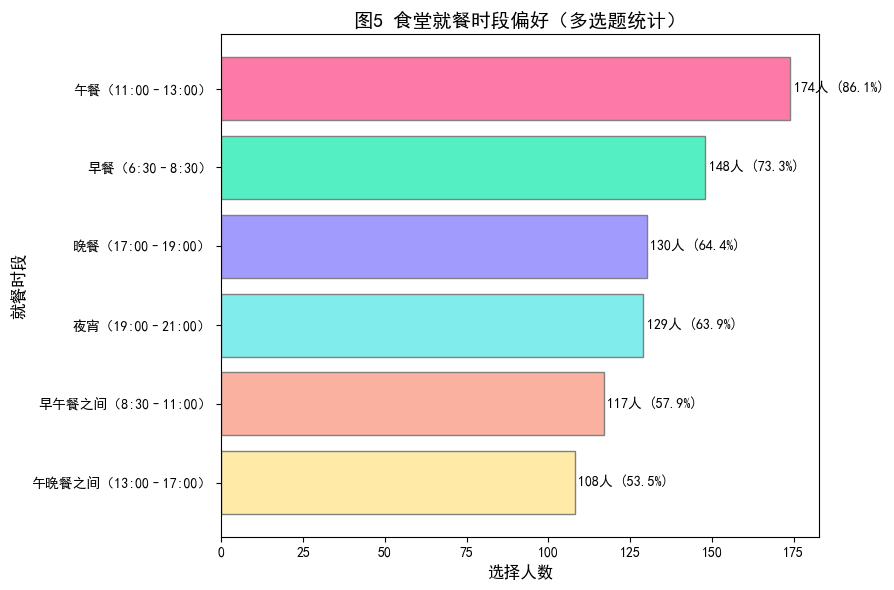
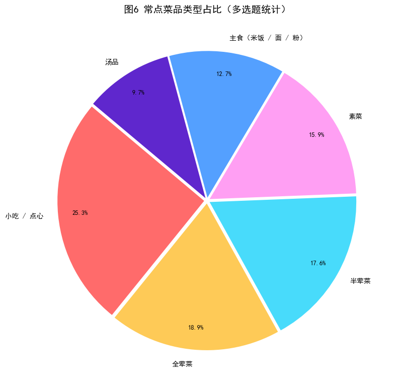
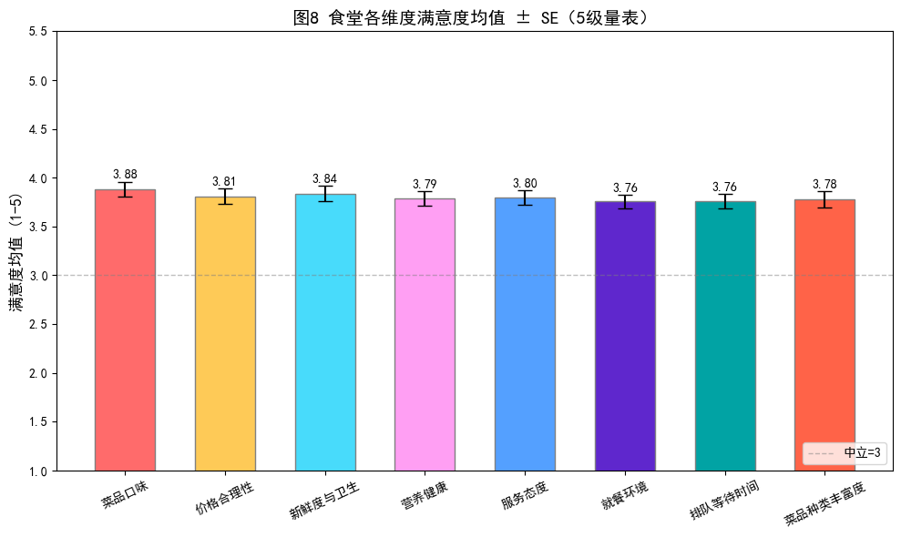
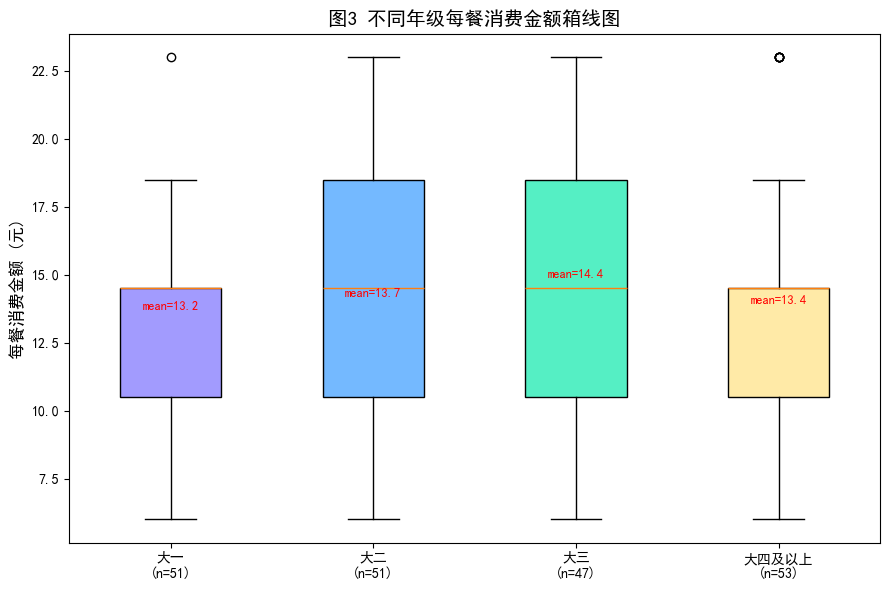
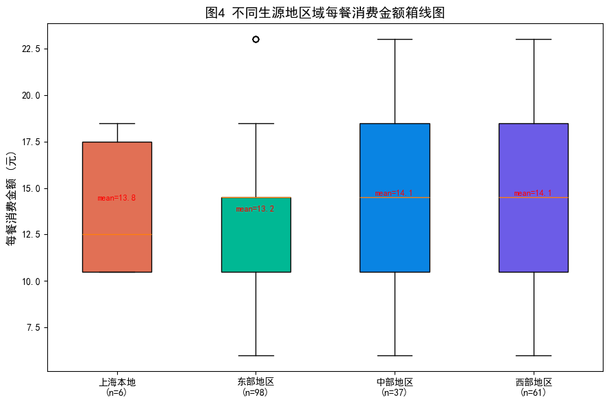
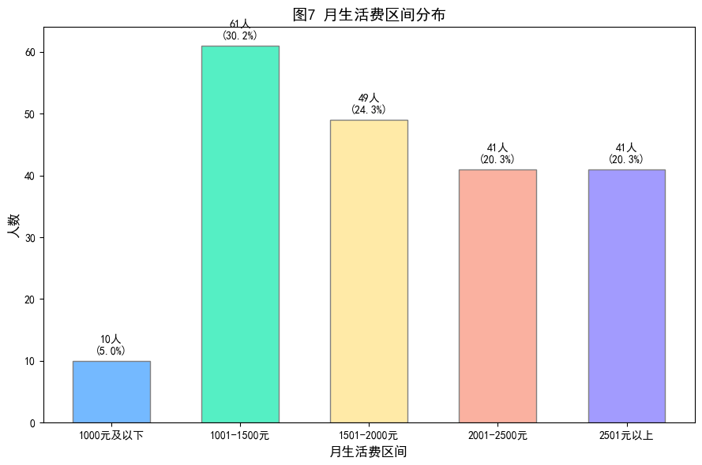

# 上海海洋大学（SHOU）大学生食堂消费模式调查统计分析报告

---

## 1. 研究问题概述

### 1.1 研究背景

高校食堂是大学生在校期间获取饮食的主要渠道，食堂的消费水平、菜品质量、价格合理性及服务质量直接影响学生的校园生活质量。了解大学生在食堂的消费模式、偏好结构及满意度水平，对于优化高校食堂运营管理、制定合理的价格策略、改善菜品供给结构具有重要的参考价值。

### 1.2 研究问题

本报告围绕以下核心问题展开：

1. 上海海洋大学学生在食堂的**每餐消费金额**呈现怎样的分布特征？
2. 不同**性别**、**年级**、**生源地区域**的学生在食堂消费金额上是否存在显著差异？
3. 学生对食堂在菜品口味、价格、卫生、服务等维度的**满意度**如何？
4. 学生的**就餐时段偏好**、**菜品类型偏好**及**心理价格预期**有何特征？

### 1.3 研究意义

通过科学的抽样调查和统计推断方法，为学校后勤管理部门提供数据驱动的决策依据，帮助食堂在有限的资源约束下精准优化供餐结构、改进服务短板，提升学生整体就餐满意度。

---

## 2. 调查设计

### 2.1 调查目的

全面了解上海海洋大学学生食堂消费模式，包括消费水平、消费频率、时段偏好、菜品偏好、价格敏感度及满意度评价，为食堂运营优化提供实证支撑。

### 2.2 调查对象

上海海洋大学全体在读本科生。最终回收有效样本 **202 份**。

### 2.3 调查方法

采用**线上问卷**（问卷星平台）进行自填式调查，通过班级群、校园社群等渠道便利抽样发放。

### 2.4 问卷设计

问卷共设 **21 道题**，涵盖以下模块：

| 题号 | 模块 | 题型 | 内容说明 |
|------|------|------|----------|
| Q1–Q3 | 个人基本信息 | 单选题 | 性别、年级、生源地（高考省份） |
| Q4–Q5 | 消费概况 | 单选题 | 月生活费区间、日均去食堂次数 |
| Q6–Q8 | 就餐频率与时段 | 多选/单选 | 最常去食堂时段、工作日/周末频率 |
| Q9–Q10 | 消费金额 | 单选题 | 每餐消费区间、偏好菜品单价区间（多选） |
| Q11–Q12 | 菜品偏好与价格敏感 | 多选/单选 | 常点菜品类型、价格上涨反应 |
| Q13–Q20 | 满意度评价 | 5级量表 | 口味、价格、卫生、营养、服务、环境、等待时间、种类 |
| Q21 | 开放建议 | 开放题 | 对食堂消费服务的改进建议 |

> *详细问卷内容见附录。*

---

## 3. 调查组织与实施

### 3.1 调查时间

[TODO: 填写问卷发放与回收的具体时间段]

### 3.2 调查对象

上海海洋大学本科生，覆盖大一至大四及以上各年级，生源地覆盖全国 30 个省级行政区。

### 3.3 调查方法

线上问卷（问卷星），便利抽样，匿名填写。

### 3.4 调查人员与组员分工

[TODO: 填写组员姓名及各自分工，如：问卷设计、数据清洗、可视化、统计分析、报告撰写分工等]

---

## 4. 数据来源与整理

### 4.1 原始数据来源

原始数据来源于问卷星导出的 Excel 文件 [`大学生食堂消费模式调查问卷.xlsx`](大学生食堂消费模式调查问卷.xlsx)，包含 202 份有效答卷，原始 27 列（含 6 列元数据）。

### 4.2 抽样误差

本调查采用便利抽样而非严格随机抽样，可能存在一定选择偏差。样本量 N=202，在 95% 置信水平下，最大抽样误差约为：

$$
e = z_{\alpha/2} \cdot \sqrt{\frac{p(1-p)}{n}} \approx 1.96 \times \sqrt{\frac{0.5 \times 0.5}{202}} \approx 6.9\%
$$

### 4.3 数据清洗流程

清洗过程采用 Python（numpy、pandas、openpyxl）编程实现，共 10 个步骤：

| 步骤 | 操作 | 说明 |
|------|------|------|
| 1 | 删除元数据列 | 移除序号、提交时间、所用时间、来源、来源详情、总分 |
| 2 | 列重命名 | 21 列中文长名 → 英文简名（如 `gender`、`grade`、`sat_taste`） |
| 3 | 去除选项前缀 | "A. 男" → "男"，共处理 16 列 |
| 3b | 文本标准化 | 统一 en-dash/em-dash → 普通连字符，去除空格（"9–12 元" → "9-12元"） |
| 4 | 生源地代码映射 | 字母代码（A–AD）→ 省份名 + 区域分类（上海本地/东部/中部/西部） |
| 5 | 消费金额区间→数值 | "8元及以下"→6.0, "9-12元"→10.5 … "21元以上"→23.0（取区间中点） |
| 6 | 生活费区间→数值 | "1000元及以下"→800, "1001-1500元"→1250 … "2501元以上"→2750 |
| 7 | 量表→数值 | "很重要"=5, "重要"=4, "中立"=3, "不重要"=2, "很不重要"=1 |
| 8 | 多选题展开 | 按 `┋` 分隔符拆分，统计各选项被选次数，生成 0/1 哑变量 |
| 9 | IQR 异常值检测 | Q1=10.50, Q3=18.50, IQR=8.00；异常范围 < -1.50 或 > 30.50；检出异常值 0 个 |
| 10 | 缺失值检查 | 无缺失值 |

清洗后数据维度：**202 行 × 54 列**，保存为 [`output/cleaned_survey.xlsx`](output/cleaned_survey.xlsx)。

### 4.4 数据整理模块架构

项目采用模块化设计，共 6 个 Python 文件：

| 模块 | 文件 | 职责 |
|------|------|------|
| 配置 | [`config.py`](config.py) | 路径、常量、全部映射字典（消费区间/生活费/生源地/） |
| 读取 | [`data_reader.py`](data_reader.py) | 读取 Excel 问卷原始数据 |
| 清洗 | [`data_cleaner.py`](data_cleaner.py) | 10 步清洗流水线 + 文本标准化 + 多选题展开 |
| 可视化 | [`visualizer.py`](visualizer.py) | 8 张 matplotlib 图表的生成函数 |
| 统计 | [`statistics.py`](statistics.py) | 独立样本 t 检验 + 单因素 方差分析 + Tukey HSD 事后比较 |
| 入口 | [`main.py`](main.py) | 编排调用上述模块，一键输出全部结果 |

---

## 5. 数据的描述性统计分析

### 5.1 样本构成

#### 性别分布

| 性别 | 人数 | 百分比 |
|------|------|--------|
| 男 | 102 | 50.5% |
| 女 | 100 | 49.5% |

男女比例接近 1:1，样本具有较好的性别代表性。

#### 年级分布

| 年级 | 人数 | 百分比 |
|------|------|--------|
| 大一 | 51 | 25.2% |
| 大二 | 51 | 25.2% |
| 大三 | 47 | 23.3% |
| 大四及以上 | 53 | 26.2% |

四个年级分布较为均匀，最大差异仅 6 人。

#### 生源地区域分布

| 区域 | 人数 | 百分比 |
|------|------|--------|
| 东部地区 | 98 | 48.5% |
| 西部地区 | 61 | 30.2% |
| 中部地区 | 37 | 18.3% |
| 上海本地 | 6 | 3.0% |

东部地区学生占比最高（近半），上海本地生源仅 6 人（3.0%），样本覆盖全国 30 个省级行政区。

> 
> *图2 不同性别每餐消费金额箱线图*

### 5.2 消费水平

#### 每月生活费区间

| 生活费区间 | 人数 | 百分比 |
|------------|------|--------|
| 1000元及以下 | 10 | 5.0% |
| 1001–1500元 | 61 | 30.2% |
| 1501–2000元 | 49 | 24.3% |
| 2001–2500元 | 41 | 20.3% |
| 2501元以上 | 41 | 20.3% |

月生活费中位区间为 1501–2000 元，均值约 1856 元，标准差约 604 元。

#### 每餐食堂消费金额

| 统计量 | 值 |
|--------|-----|
| 样本量 N | 202 |
| 均值 | **13.66 元** |
| 标准差 | 4.76 元 |
| 最小值 | 6.00 元 |
| Q1（25%分位） | 10.50 元 |
| 中位数 | **14.50 元** |
| Q3（75%分位） | 18.50 元 |
| 最大值 | 23.00 元 |
| IQR | 8.00 元 |

消费金额分布呈略右偏态，均值与中位数接近（13.66 vs 14.50），说明整体分布较为对称。IQR 异常值检测未发现异常样本（0 个）。

> 
> *图1 每餐食堂消费金额分布直方图与核密度估计*

### 5.3 就餐行为

#### 日均去食堂次数

| 次数 | 人数 | 百分比 |
|------|------|--------|
| 少于1次 | 23 | 11.4% |
| 1次 | 71 | 35.1% |
| 2次 | 51 | 25.2% |
| 3次 | 44 | 21.8% |
| 4次及以上 | 13 | 6.4% |

超六成（60.3%）学生每天去食堂 1–2 次。

#### 工作日 vs 周末就餐频率

| 频率 | 工作日 | 周末 |
|------|--------|------|
| 几乎每天 | 91 (45.0%) | 78 (38.6%) |
| 每周 3–4 次 | 49 (24.3%) | 70 (34.7%) |
| 每周 1–2 次 | 41 (20.3%) | 20 (9.9%) |
| 几乎不去 | 21 (10.4%) | 34 (16.8%) |

周末"几乎每天"去食堂的比例（38.6%）低于工作日（45.0%），"几乎不去"的比例（16.8%）高于工作日（10.4%），说明周末有更多学生选择校外就餐或外卖。

### 5.4 菜品偏好

#### 就餐时段偏好（多选，n=202）

| 时段 | 选择人数 | 百分比 |
|------|----------|--------|
| 午餐（11:00–13:00） | 174 | 86.1% |
| 早餐（6:30–8:30） | 148 | 73.3% |
| 晚餐（17:00–19:00） | 130 | 64.4% |
| 夜宵（19:00–21:00） | 129 | 63.9% |
| 早午餐之间（8:30–11:00） | 117 | 57.9% |
| 午晚餐之间（13:00–17:00） | 108 | 53.5% |

午餐为最高峰时段（86.1%），其次为早餐（73.3%）。值得注意的是，夜宵时段也有 63.9% 的学生选择，表明晚间供餐需求不容忽视。

> 
> *图5 食堂就餐时段偏好（多选题统计）*

#### 常点菜品类型（多选，n=202）

| 菜品类型 | 选择人数 | 百分比 |
|----------|----------|--------|
| 小吃 / 点心 | 193 | **95.5%** |
| 全荤菜 | 144 | 71.3% |
| 半荤菜 | 134 | 66.3% |
| 素菜 | 121 | 59.9% |
| 主食（米饭/面/粉） | 97 | 48.0% |
| 汤品 | 74 | 36.6% |

小吃/点心类几乎是普遍选择（95.5%），全荤菜和半荤菜偏好度均超 65%，而主食类仅 48.0%（因主食通常与菜品搭配而非单独选择）。

> 
> *图6 常点菜品类型占比（多选题统计）*

#### 偏好菜品单价区间（多选，n=202）

| 价格区间 | 选择人数 | 百分比 |
|----------|----------|--------|
| 4–6 元 | 163 | 80.7% |
| 7–9 元 | 153 | 75.7% |
| 3 元及以下 | 73 | 36.1% |
| 10 元及以上 | 61 | 30.2% |

大多数学生（80.7%）偏好的菜品单价区间为 4–6 元，其次为 7–9 元（75.7%），这与每餐消费均值 13.66 元（通常包含多道菜品 + 主食的组合）一致。

### 5.5 价格敏感度

| 若菜品整体上涨 10% 的反应 | 人数 | 百分比 |
|---------------------------|------|--------|
| 减少食堂就餐次数 | 69 | 34.2% |
| 改点更多低价菜品 | 67 | 33.2% |
| 减少荤菜、增加素菜 | 46 | 22.8% |
| 基本无变化 | 20 | 9.9% |

仅 9.9% 的学生表示对 10% 的价格上涨无动于衷，**约 90% 的学生会做出行为调整**（减少频次/降低客单价/调整菜品结构），显示出较高的价格弹性。

### 5.6 食堂满意度评价（ 5 级量表）

| 维度 | 均值 | 标准差 | 最小值 | 最大值 |
|------|------|--------|--------|--------|
| 菜品口味 | **3.881** | 1.095 | 1 | 5 |
| 新鲜度与卫生 | 3.837 | 1.114 | 1 | 5 |
| 价格合理性 | 3.807 | 1.127 | 1 | 5 |
| 服务态度 | 3.797 | 1.117 | 1 | 5 |
| 营养健康 | 3.787 | 1.041 | 1 | 5 |
| 菜品种类丰富度 | 3.777 | 1.148 | 1 | 5 |
| 就餐环境 | 3.757 | 0.985 | 1 | 5 |
| 排队等待时间 | 3.757 | 1.030 | 1 | 5 |

所有维度均值均在 3.75–3.88 之间（高于中立值 3），属于**中等偏上**的满意度水平。其中：

- **菜品口味**得分最高（3.881），说明学生对食堂"好吃不好吃"整体较认可；
- **就餐环境**和**排队等待时间**得分并列最低（3.757），是相对薄弱的环节；
- 各维度标准差均在 1.0–1.15 之间，说明学生意见存在一定分化。

> 
> *图8 食堂各维度满意度均值 ± SE（5级量表）*

### 5.7 分组消费特征

#### 按性别分组

| 性别 | n | 均值 | 标准差 |
|------|---|------|--------|
| 男 | 102 | **12.85 元** | 4.73 |
| 女 | 100 | **14.48 元** | 4.68 |

女生每餐消费均值比男生高约 **1.63 元**（高出 12.7%）。

#### 按年级分组

| 年级 | n | 均值 | 标准差 |
|------|---|------|--------|
| 大一 | 51 | 13.20 元 | 4.16 |
| 大二 | 51 | 13.69 元 | 5.08 |
| 大三 | 47 | **14.39 元** | 4.72 |
| 大四及以上 | 53 | 13.42 元 | 5.08 |

大三学生消费均值最高（14.39 元），大一最低（13.20 元），差值约 1.19 元，但整体差异不大。

> 
> *图3 不同年级每餐消费金额箱线图*

#### 按生源地区域分组

| 区域 | n | 均值 | 标准差 |
|------|---|------|--------|
| 上海本地 | 6 | 13.83 元 | 3.93 |
| 东部地区 | 98 | 13.23 元 | 4.41 |
| 中部地区 | 37 | **14.07 元** | 4.46 |
| 西部地区 | 61 | **14.07 元** | 5.55 |

中部和西部地区学生消费均值相同（14.07 元），高于东部地区（13.23 元）。上海本地样本量小（n=6），参考价值有限。

> 
> *图4 不同生源地区域每餐消费金额箱线图*

---

## 6. 统计模型分析

### 6.1 方法一：独立样本 t 检验（性别 vs 每餐消费金额）

**假设：**

- H₀: μ_男 = μ_女（男女生每餐消费金额均值相等）
- H₁: μ_男 ≠ μ_女（男女生每餐消费金额均值不等）
- α = 0.05

**检验步骤：**

1. 先进行 **Levene 方差齐性检验**：

   - Levene 统计量 = 0.7803，p = 0.3781
   - p > 0.05 → 不能拒绝方差齐性假设，采用**等方差 t 检验**

2. 独立样本 t 检验：

| 检验量 | 值 |
|--------|-----|
| t 统计量 | **-2.4644** |
| p 值 | **0.0146** |
| 自由度 | 200 |

**结论：**

p = 0.0146 < 0.05，**拒绝 H₀**。男女生每餐食堂消费金额存在**统计显著差异**。

女生每餐消费均值（14.48 元）显著高于男生（12.85 元），差异约 1.63 元。可能的原因包括：
- 女生可能更倾向于选择搭配更丰富的菜品组合（如小吃/点心类选择率 95.5%）；
- 女生可能更注重菜品多样性，倾向于单次购买更多种类；
- 消费心理差异：男生可能更关注"吃饱"而女生更关注"吃好"。

> 
> *图7 月生活费区间分布*

### 6.2 方法二：单因素 方差分析（年级 vs 每餐消费金额）

**假设：**

- H₀: μ_大一 = μ_大二 = μ_大三 = μ_大四及以上
- H₁: 至少有一组均值不等
- α = 0.05

**检验结果：**

| 检验量 | 值 |
|--------|-----|
| F 统计量 | **0.5760** |
| p 值 | **0.6314** |

**结论：**

p = 0.6314 ≥ 0.05，**不拒绝 H₀**。不同年级学生在食堂每餐消费金额上**不存在统计显著差异**。学生的食堂消费水平并不随年级增长而发生系统性变化。这可能说明食堂的菜品价位覆盖较为稳定，各年级学生选择的菜品组合差异不大。

### 6.3 方法三：单因素 方差分析（生源地区域 vs 每餐消费金额）

**假设：**

- H₀: μ_上海 = μ_东部 = μ_中部 = μ_西部
- H₁: 至少有一组均值不等
- α = 0.05

**检验结果：**

| 检验量 | 值 |
|--------|-----|
| F 统计量 | **0.5090** |
| p 值 | **0.6765** |

**结论：**

p = 0.6765 ≥ 0.05，**不拒绝 H₀**。不同生源地区域的学生在食堂每餐消费金额上**不存在统计显著差异**。虽然中西部地区学生均值（14.07 元）略高于东部地区（13.23 元），但差异未达到统计显著水平。这可能因为：
- 学校食堂的价格结构对所有学生一视同仁；
- 进入大学后，来自不同地区的学生消费习惯趋于同化；
- 上海本地样本量极小（n=6），限制了区域间精细比较的统计效力。

### 6.4 统计检验汇总

| 检验方法 | 检验量 | p 值 | α=0.05 下结论 |
|----------|--------|------|----------------|
| t 检验（性别） | t = -2.4644 | **0.0146** | ✅ 显著（拒绝 H₀） |
| 方差分析（年级） | F = 0.5760 | 0.6314 | ❌ 不显著 |
| 方差分析（区域） | F = 0.5090 | 0.6765 | ❌ 不显著 |

> 完整统计检验结果已保存至 [`output/statistics_results.txt`](output/statistics_results.txt)。

---

## 7. 问题的分析解决

### 7.1 核心发现

1. **消费水平**：上海海洋大学学生食堂每餐消费均值约 **13.66 元**（中位数 14.50 元），月生活费均值约 **1856 元**，食堂消费约占月生活费的 22%（按日均 2 次、每餐 13.66 元、每月 30 天估算：13.66 × 2 × 30 ≈ 820 元 / 1856 ≈ 44.2%；若按实际日均 1–2 次计则更低）。

2. **性别差异显著**：女生每餐消费（14.48 元）显著高于男生（12.85 元），差异约 1.63 元（t = -2.4644, p = 0.0146）。这是唯一通过显著性检验的人口学变量。

3. **年级和区域差异不显著**：不同年级（p = 0.6314）和不同生源地区域（p = 0.6765）的学生在食堂消费金额上不存在统计显著差异，说明食堂消费水平在入学后趋于均质化。

4. **价格敏感度高**：面对 10% 的价格上涨，90.1% 的学生会做出行为调整（减少频次/调整菜品结构/选择低价菜品），仅 9.9% 表示无变化。

5. **满意度中等偏上但仍有提升空间**：8 个满意度维度均值在 3.76–3.88 之间，均高于中立值 3。菜品口味得分最高（3.88），就餐环境和排队等待时间得分最低（3.76）。

6. **偏好特征**：
   - 午餐是最集中的就餐时段（86.1%），但夜宵需求（63.9%）也不容忽视；
   - 小吃/点心是近乎普遍的选择（95.5%）；
   - 最受欢迎的菜品单价区间为 4–6 元（80.7%）和 7–9 元（75.7%）。

### 7.2 对策建议

#### 建议一：关注女性学生消费需求

女生消费均值显著高于男生，建议食堂在菜品开发中适当考虑女性学生偏好（如轻食、小份精致菜品、多样化的点心选择），同时提供差异化的份量选项（如小份/中份/大份），满足不同性别学生的需求。

#### 建议二：稳定价格体系，提升性价比感知

90% 的学生对价格敏感（上涨 10% 即会调整行为），且"价格合理性"满意度仅为 3.807（在 8 个维度中排名第 3）。建议食堂：
- 维持现有价格水平稳定；
- 增加 4–9 元区间的菜品供给（契合 75%–80% 学生的心理预期）；
- 推出"经济套餐"组合，提升性价比感知。

#### 建议三：优化就餐环境与排队体验

"就餐环境"和"排队等待时间"是满意度最低的两个维度（均为 3.757），应作为重点改进方向：
- 优化高峰时段（午餐 11:00–13:00）的窗口开放数量和动线设计；
- 引入"错峰就餐"激励机制（如非高峰时段优惠）；
- 改善餐厅照明、座位舒适度和清洁频率。

#### 建议四：增强夜宵时段供餐能力

63.9% 的学生有夜宵需求，建议延长晚间供餐时间或在晚间开设专门夜宵窗口，提供轻便快捷的夜宵品类（如点心、小份简餐）。

#### 建议五：提升菜品种类丰富度

"菜品种类丰富度"满意度（3.777）低于口味（3.881），说明学生认为菜品"好吃但不够多"。建议定期轮换菜单，引入季节性特色菜品和地方风味窗口，增强新鲜感。

### 7.3 研究局限性

1. **抽样方法**：采用便利抽样而非概率抽样，样本代表性存在一定局限，统计推断结果的外推需谨慎。
2. **样本量**：N=202 对于部分分组（如上海本地 n=6、中部地区 n=37）的统计分析效力可能不足，影响了区域 方差分析 的检验功效。
3. **测量精度**：消费金额采用区间中值代替连续测量，会引入一定的近似误差。
4. **自我报告偏差**：生活费、消费金额等为被调查者自我报告，可能存在回忆偏差或社会期望偏差。

---

## 附录

### 附录 A：输出文件清单

所有输出文件位于 [`output/`](output/) 目录下：

| 文件名 | 说明 |
|--------|------|
| `cleaned_survey.xlsx` | 清洗后完整数据（202 行 × 54 列） |
| `fig1_consumption_hist.png` | 每餐消费金额直方图 + KDE |
| `fig2_boxplot_gender.png` | 消费金额箱线图（按性别） |
| `fig3_boxplot_grade.png` | 消费金额箱线图（按年级） |
| `fig4_boxplot_region.png` | 消费金额箱线图（按区域） |
| `fig5_meal_period_bar.png` | 就餐时段偏好柱状图 |
| `fig6_dish_type_pie.png` | 菜品类型偏好饼图 |
| `fig7_living_expense_bar.png` | 月生活费区间柱状图 |
| `fig8_likert_bar.png` | 满意度均值 ± SE 柱状图 |
| `statistics_results.txt` | 统计检验完整结果 |

### 附录 B：Python 代码模块

| 文件 | 行数 | 功能 |
|------|------|------|
| [`config.py`](config.py) | 162 | 全局配置、路径、映射字典、工具函数 |
| [`data_reader.py`](data_reader.py) | 22 | Excel 数据读取 |
| [`data_cleaner.py`](data_cleaner.py) | 225 | 10 步清洗流水线 + 多选题展开 + IQR 检测 |
| [`visualizer.py`](visualizer.py) | 386 | 8 张 matplotlib 图表生成 |
| [`statistics.py`](statistics.py) | 298 | t 检验 + 方差分析 + Tukey HSD |
| [`main.py`](main.py) | 67 | 流程编排入口 |

### 附录 C：问卷原始题项

[TODO: 可在此粘贴完整的问卷题目原文]

---

*报告生成日期：[TODO]*  
*报告撰写人：[TODO]*  
*数据分析工具：Python 3 (numpy, pandas, matplotlib, scipy)*
